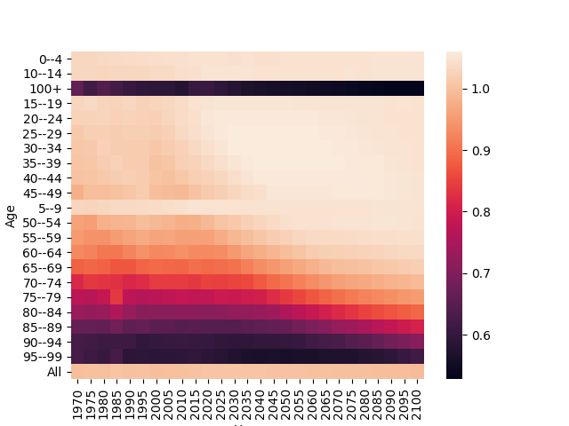
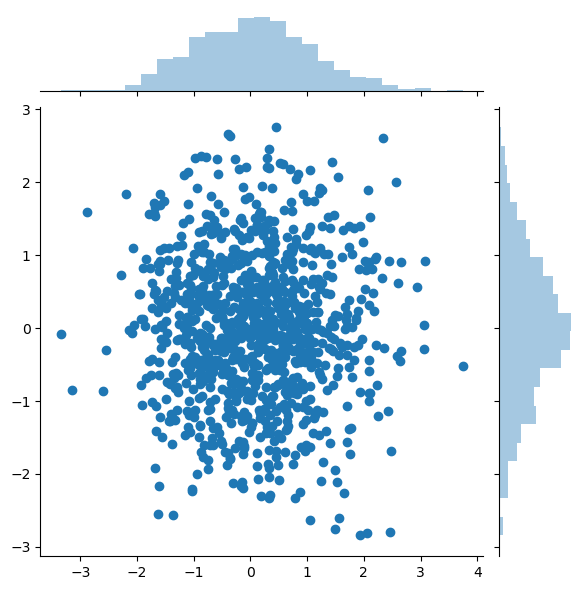

# Data-analysis-and-visualisation-on-large-datasets
Analyse large datasets using Pandas, Seaborn and Heatmaps by visualising and presenting feasible solutions to existing problems. This project was done for Takenmind during February 2019

